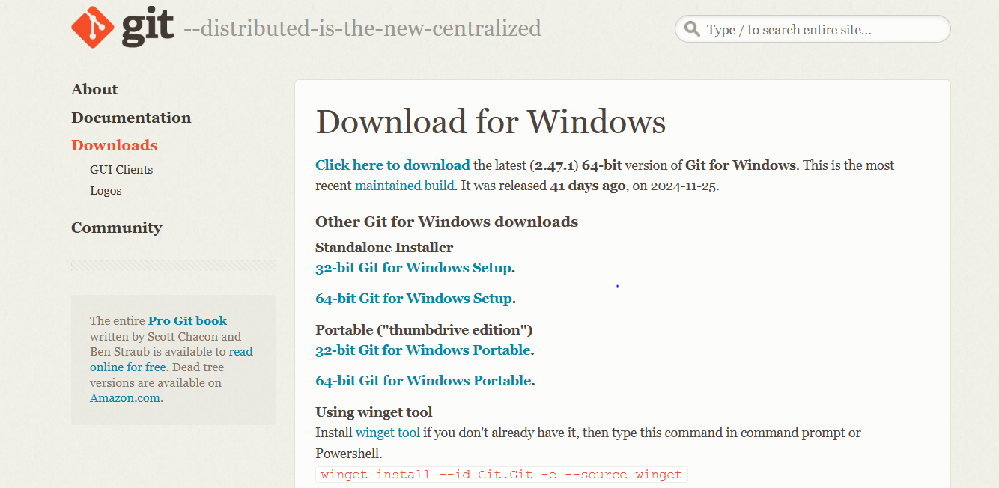
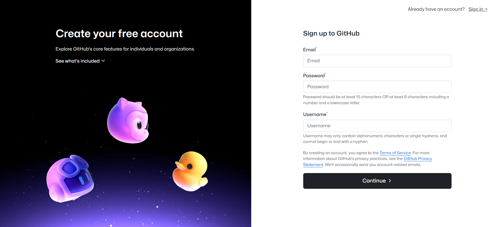
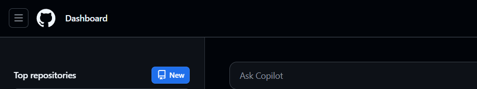
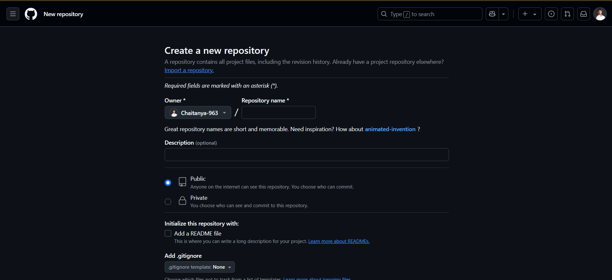
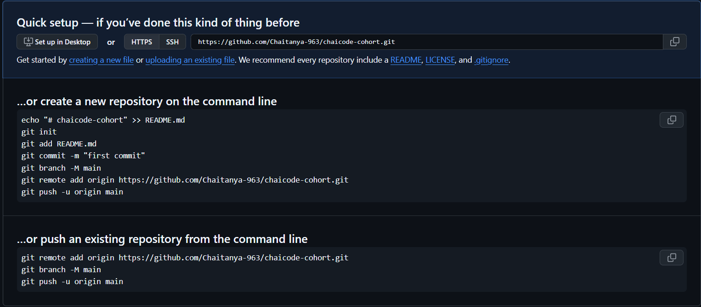
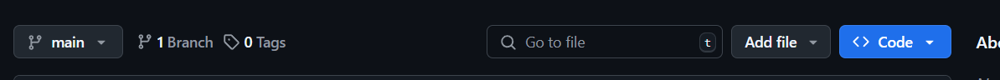
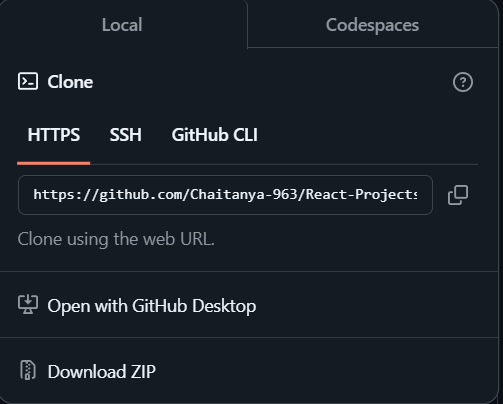

# Your First Cup of Git: The Chai Code Cohort Guide to Git & GitHub 👨🏼‍💻

<aside> 

**👉🏼 Introduction**
 

**Hey!** Welcome to Chai Code cohort team! As a company perspective Git and GitHub are very crucial technologies for version control, teamwork and collaboration.. So here is the “SOLUTION” this docs is meant to help you get started with them.

GitHub and Git will be your go-to tools for managing code changes, working together on features and settling disputes. Get ready to contribute successfully by following this onboarding guide

</aside>

Lets Go..!➡️

<aside>

👉🏼 The First question comes in mind will be.. What is **Git** and **GitHub**? 🤔

### Git


**Here is the answer** - Git is a distributed version control system that allows developers to track changes in their code, collaborate on projects, and manage versions efficiently. It helps ensure you can revert to earlier states of your project if necessary.

### GitHub


**Here is the answer** - GitHub is a cloud-based platform for hosting Git repositories(repos). It offers tools for team collaboration, including pull requests, issues tracking, and project records. GitHub is where Chai Code developer collaborate and maintain project repositories.

</aside>

<aside>


**👉🏻 Some additional info:**

- **Version control system?**
    
    The history of your code is managed via version control systems. They let you work together and keep track of file modifications. Software development requires version control systems. Think of version control as a game checkpoint. You can always return to the previous checkpoint and go to any point in the game. In software development, this idea is the same.
    
- **Repository?**
A **repository** (repo) is like a digital folder where your project's code, files, and version history are stored. It’s the core structure used by Git and GitHub to organize and manage projects.

</aside>

## 👉🏼 Installation of Git & GitHub:

1. **Installing Git**                                      
    - **Windows**
        - Download the git installer from [git-scm.com](https://git-scm.com/)
            
            
            
    - **MacOS**
        - Install homebrew if not already installed:
            
            ```
            /bin/bash -c "$(curl -fsSL https://raw.githubusercontent.com/Homebrew/install/HEAD/install.sh)"
            ```
            
        - Install Git:
            
            ```
            brew install git
            ```
            
    - **Linux**
        - Use your package manager to install Git:
            
            ```
            sudo apt install git
            ```
            
    

1. **Configuring Git**
    - Using User name and email:
        
        ```
        git config --global user.name "Your Name"
        git config --global user.email "your.email@example.com"
        ```
        

1. **GitHub Account setup:**
    - Go to [GitHub](https://github.com/) and sign up for a free account.
        
        
        
    - Verify your email address.

## 👉🏼 Cloning the Chai Code Repository:

- So Now you create your GitHub account, now sign in.
    - Then go to repository section on GitHub.
    - Create new repo.
        - Dashboard view:
            
            
            
        - Repository section view:
            
            
            
    - Fill the details correctly:
        
        
        
    - Follow this quick setup in vs code terminal:
        
        
        
    - Then click on code button:
        
        
        
    - Copy the repository's HTTPS URL or SSH URL.
        
        
        
    - Clone the repository locally:
        
        ```
        git clone https://github.com/ChaiCode/example-repo.git
        cd example-repo
        ```

## **👉🏼 Basic Git Commands:**

| **Command** | **Description** |
| --- | --- |
| `git status` | Check the status of your working directory. |
| `git add <file>` | Add changes to the staging area. |
| `git commit -m "Message"` | Save staged changes to the repository. |
| `git push origin` | Push committed changes to the remote repository. |
| `git pull origin` | Fetch and merge changes from the remote repository. |
| `git log` | View the history of commits. |
| `git clone` | Used to clone the repository in your local system. |
| `git init` | Initializing .git file inside the desired folder for tracking the file. |
- Commands:
    1. **git status**
        
        ```
        On branch main
        Your branch is up to date with 'origin/main'.
        
        Untracked files:
          (use "git add <file>..." to include in what will be committed)
            README.md
        ```
        
    2. **git add <file name>**
        
        ```
        git add README.md
        ```
        
    3. **git commit -m “Message”**
        
        ```
        git commit -m "Add initial onboarding documentation"
        
        ```
        
    4. **git push origin <branch name>**
        
        ```
        git push origin main
        ```
        
    5. **git pull origin <branch name>**
        
        ```
        git pull origin main
        ```
        
    6. **git log**
        
        ```
        commit d1e8f9b2f8f6b99b9a8b41a8c7e9f7e3a2f59d24
        Author: Chaitanya <chaitanya@example.com>
        Date:   Sat Jan 5 14:32:00 2025 +0530
        
            docs: Add initial onboarding documentation
        ```
        
    7. **git clone <URL>**
        
        ```
        git clone https://github.com/ChaiCode/example-repo.git
        cd example-repo
        ```
        
    8. **git init** 
        
        ```
        cd my-project        # Navigate to the project folder
        git init             # Initialize a Git repository
        ```
        
   

## 👉🏼 **Commit Message Rules:**

- Important to understand the rules to work at Chai Code
    1.  Use the present tense ("Add feature" not "Added feature").
    2.  Use camel casing in message.
    3. Keep the message short (40-50 characters or less).
    4. Use prefixes like `fix:`, `feat:`, `chore:`, `docs:` for categorization.
        - **feat:** for new features.
        - **fix:** for bug fixes.
        - **docs:** for documentation updates.
        - **chore:** for maintenance.
    5. Use Meaning full message with appropriate prefixe (git commit -m “feat: Add profile updating feature”)
    

## 👉🏼 **Branching Workflow**

<aside>

### **Branching Strategy**

- **`main`**: Contains stable, production-ready code.
- **`development`**: Contains code under active development.
- **Feature branches**: Created for new features or bug fixes.
    
    ```
    git branch feature/tea-menu
    git checkout feature/tea-menu
    ```
    

### **Merging Branches**

1. Once the feature is complete, merge it into `development` or `main`:
    
    ```bash
    git checkout main
    git merge feature/tea-menu
    ```
    
2. Resolve conflicts if any arise during the merge.


</aside>

## **👉🏼 Pull Requests (PR)**

<aside>

1. Push your feature branch to GitHub:
    
    ```bash
    bash
    Copy code
    git push origin feature/tea-menu
    ```
    
2. On GitHub, click "New Pull Request" in the repository.
3. Add a detailed description of the changes and request a code review.

### Pull Request Description Example:

```css
css
Copy code
### Description
This PR adds a tea selection feature to the application.

### Changes
- Add dropdown menu for tea types.
- Update CSS for menu styling.

### Checklist
- [x] Code reviewed.
- [x] Tests passed.
```

</aside>

## **👉🏼 Best Practices**

1. **Commit regularly**: Save your progress frequently.
2. **Write descriptive commit messages**: Ensure your messages explain the changes clearly.
3. **Pull updates often**: Stay up-to-date with the remote repository to avoid conflicts.